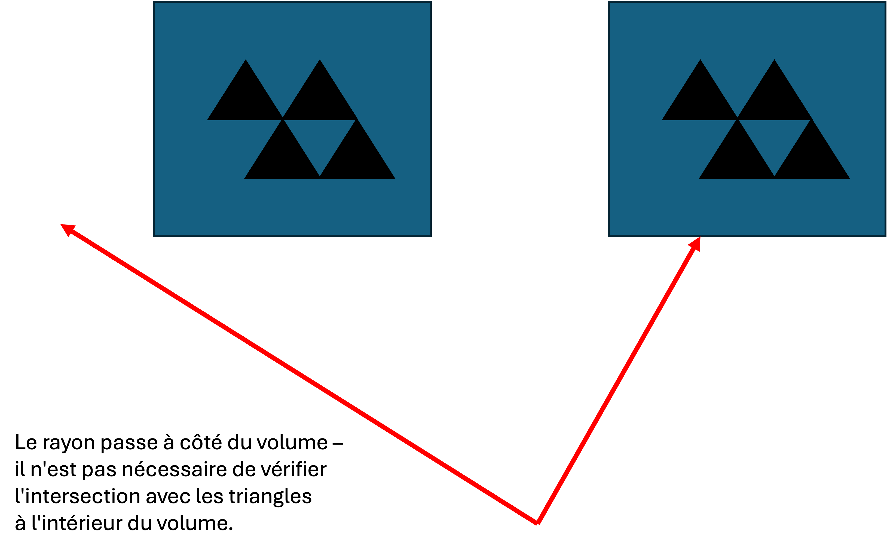
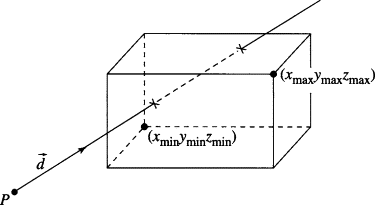

# Complexité 1 - volumes limites

Quelle est la complexité de calcul pour un rayon unique dans une scène qui est réfléchi plusieurs fois ?

En fait, c'est plutôt mauvais !

Considérons notre algorithme actuel :

1. Construire un rayon
2. Boucle sur N objets de la scène pour calculer l'intersection la plus proche. 
3. Pour chaque intersection :
  1. Pour les ombres : Construire un rayon à partir du point d'intersection jusqu'à la lumière. Bouclez sur N objets pour déterminer s'il y a une intersection entre le point et la lumière (si c'est le cas, le point est dans l'ombre).
  2. Pour les réflexions : Construire un rayon réfléchi autour de la normale à la surface et recommencer l'étape 2. 

Rien que pour les objets et les ombres, nous sommes déjà à une complexité de calcul de :

$$
\theta(n^2)
$$

En d'autres termes, nous devons parcourir l'ensemble des objets de notre scène juste pour trouver une intersection, puis à nouveau l'ensemble des objets juste pour vérifier s'il y a une ombre.

Maintenant, nous ajoutons une seule réflexion, ce qui ajoute encore $n^2$ calculs par réflexion.

Répétez ce processus pour $width*height$ pixels, et nous atteignons rapidement une complexité polynomiale :

$$
O(n^4)
$$



En réalité, selon [Reif, Tygar et Yoshida](https://link.springer.com/content/pdf/10.1007/bf02574009.pdf), le ray-tracing va de **indécidable** à **PSPACE difficile**


Existe-t-il un moyen d'améliorer cette performance ?

## Bounding volumes

Comparez le rendu d'une scène sans géométrie de maillage avec celui d'une scène contenant une géométrie de maillage. Vous remarquerez une grande différence ! Pour chaque triangle ajouté à notre traceur de rayons, nous augmentons notre complexité !

Même pour les espaces de notre image qui ne contiennent pas d'objets, nous n'avons pas d'autre choix que de parcourir TOUS les objets (chaque triangle !) de la scène pour nous assurer qu'il n'y a pas d'intersection.

Peut-être, pour des objets complexes tels que notre maillage, pourrions-nous approximer le volume qui enveloppe notre objet (une forme plus simple). Si le rayon n'atteint pas ce volume, il n'y a aucune chance que le rayon atteigne un triangle à l'intérieur du volume !



Pour que cela fonctionne, le calcul de l'intersection rayon-volume doit être assez efficace.

## AABB

Une **Axis-Aligned Bounding Box** est une structure simple permettant d'envelopper une géométrie complexe.

Il s'agit d'une forme cubique dont les faces sont alignées sur nos axes X, Y et Z.



Source: https://www.sciencedirect.com/topics/computer-science/aligned-bounding-box

Nous définissons la boîte en utilisant seulement 2 vecteurs :

- Un vecteur `minPt`, avec les valeurs minimales X, Y, et Z
- Un vecteur `maxPt`, avec les valeurs X, Y et Z maximales.

Cela forme implicitement un parallélépipède rectangle.

Comment déterminer les valeurs de `minPt` et `maxPt` pour un maillage ?
Ò
```ts
Vector3 minPt = (INFINITY, INFINITY, INFINITY);
Vector3 maxPt = (-INFINITY, -INFINITY, -INFINITY);
foreach (triangle in mesh.triangles) {

    foreach( point in triangle.points) {
        minPt = (min(minPt.x, point.x), min(minPt.y, point.y), min(minPt.z, point.z))
        maxPt = (max(maxPt.x, point.x), max(maxPt.y, point.y), max(maxPt.z, point.z))
    }
}
```

Cet algorithme simple agrandira la boîte pour qu'elle contienne tous les points du triangle !

## Ray-AABB intersection

Il existe des algorithmes très optimisés pour détecter l'intersection d'un rayon AABB, par exemple [ici](https://tavianator.com/2011/ray_box.html) :

```c++
bool AABB::intersects(Ray& r) {

    Vector3 o = r.GetPosition();
    Vector3 dInv = r.GetDirection().inverse();

    double tx1 = (Min.x - o.x)*dInv.x;
    double tx2 = (Max.x - o.x)*dInv.x;

    double tmin = std::min(tx1, tx2);
    double tmax = std::max(tx1, tx2);

    double ty1 = (Min.y - o.y)*dInv.y;
    double ty2 = (Max.y - o.y)*dInv.y;

    tmin = std::max(tmin, std::min(ty1, ty2));
    tmax = std::min(tmax, std::max(ty1, ty2));

    double tz1 = (Min.z - o.z)*dInv.z;
    double tz2 = (Max.z - o.z)*dInv.z;

    tmin = std::max(tmin, std::min(tz1, tz2));
    tmax = std::min(tmax, std::max(tz1, tz2));

    return tmax >= tmin && tmax > 0;
}
```

Ce qui précède est mon implémentation en C++ à l'intérieur du projet (dans la classe `AABB`). Comme vous pouvez le voir, il n'y a pas de divisions ou de branches dans le code !

Lisez attentivement l'article fourni pour comprendre comment fonctionne leur optimisation - il s'agit d'une manière très intelligente de manipuler la norme de virgule flottante pour éviter les divisions !

## AABBs pour l'optimisation

Maintenant que nous avons la notion d'AABB, nous voulons ajuster notre algorithme de rendu pour **éviter** de vérifier un tas d'objets en vérifiant d'abord leur boîte englobante.

Voici notre algorithme actuel 

```ts
Ray ray = ...

foreach (object in scene) {
    if (ray.intersects(object)) {
        // perform shading and reflection
    }
}
```

Nous pouvons optimiser l'algorithme comme suit :

```ts

// Before the render, calculate the bounding box for every object in the scene
foreach (object in scene) {
    object.calculateBoundingBox();
}

...

Ray ray = ...

foreach (object in scene) {
    // If the ray does not intersect the object's bounding box, just skip the object
    if (!ray.intersects(object.boundingBox)) { 
        continue 
    }

    // If we arrive here, the bounding box was hit, 
    // we need to perform a precise intersection calculation
    if (ray.intersects(object)) {
        // perform shading and reflection
    }
}

```

Regardez la classe `Mesh` dans le projet de démonstration. C'est juste une liste d'objets `Triangle` ! Si l'on ajoute une boîte de délimitation à l'objet mesh, on peut ignorer tous les triangles intérieurs si le rayon ne touche pas la boîte !


