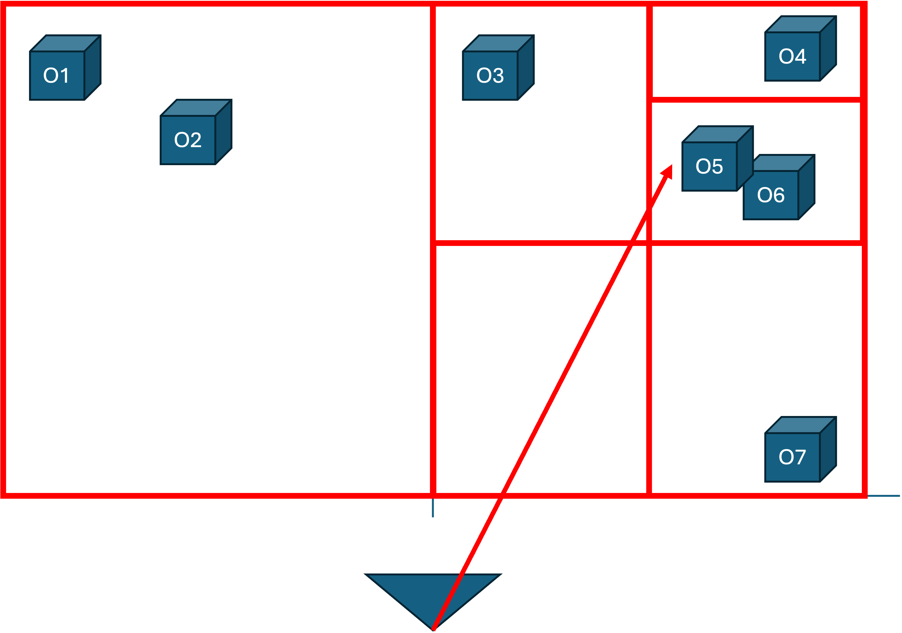
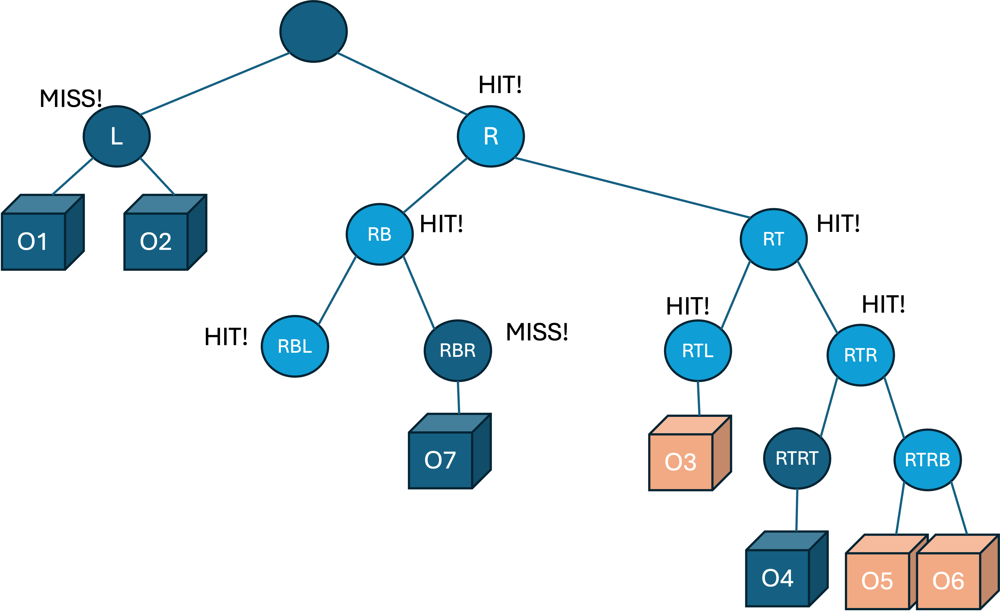

# Optimisation : BSP-Tree

Nous pouvons encore optimiser notre algorithme en excluant totalement des zones entières (et leurs objets) de nos calculs d'intersection.

Considérons le diagramme suivant :



Dans notre implémentation actuelle, nous devrions toujours tester les intersections entre notre rayon et les 7 objets (même si certains d'entre eux sont des objets maillés avec une boîte de délimitation).

Nous pouvons optimiser notre recherche d'intersection en utilisant une approche inspirée de la recherche binaire, appelée arbre de partition de l'espace binaire (**Binary Space Partition Tree** ou **BSP Tree**).

Dans l'image ci-dessus, nous divisons récursivement notre espace en deux, en créant à chaque fois un nouvel AABB qui englobe les espaces divisés. L'idée est de former une arborescence comme la suivante :



Seuls les nœuds feuilles de notre arbre contiennent des objets, tous les nœuds intermédiaires n'étant que des AABB.

Lorsque nous lançons un rayon, nous commençons à la racine de notre arbre et nous vérifions les intersections rayon-AABB avec les 2 enfants. S'il n'y a pas d'intersection avec un enfant, nous pouvons ignorer toute cette branche de l'arbre !

Dans notre exemple, puisque notre rayon n'intersecte pas l'AABB `L`, nous n'avons pas besoin de vérifier ses objets enfants `O1` et `O2`. Nous parcourons l'arbre, en entrant dans l'AABB qui a le point d'intersection le plus proche. 

Lorsque nous atteignons un AABB qui n'a que des objets comme enfants, nous devons alors vérifier uniquement ces objets pour les intersections avec notre rayon.

Dans notre exemple, il suffit de vérifier les intersections des objets 03, O5 et 06, ce qui nous évite de vérifier les quatre autres objets de la scène !



Il est évident que dans notre exemple, il y a eu plus de calculs d'intersection rayon-AABB que de calculs rayon-objet. Cependant, plus il y a d'objets dans notre scène, plus cet algorithme optimise la recherche.


Comme pour la recherche binaire, nous réduisons notre complexité à :

$$
nlog(n)
$$

puisque nous divisons l'espace par deux chaque fois que nous sélectionnons un AABB.

## Structure des données pour l'optimisation

Il s'agit d'un excellent exemple d'utilisation de la bonne structure de données pour stocker nos données afin d'optimiser leur traitement.

Vous savez probablement déjà que pour rechercher efficacement un nom dans une très longue liste de noms, nous pouvons utiliser une recherche binaire si la **liste est déjà triée par ordre alphabétique**.

De la même manière, nous allons préparer les données de notre scène pour qu'elles puissent être interrogées efficacement par le raytracer. Cela signifie que nous avons besoin d'une étape de prétraitement avant d'entamer le rendu :


```c++

// Preprocessing step to build the BSPTree
BSPTree tree = new BSPTree();
foreach(SceneObject obj in objects) {
    tree.add(obj);
}

...

// Use the BSP tree in the rendering step 
render(tree);

```

Et lorsque nous lançons un rayon :

```c++

vector<SceneObject*> objects;
if (tree.instersects(ray, &objects)) {

    // The objects vector contains the list of objects in the AABB identified as having
    // the closest intersection.

    // Continue with the regular raytracing algorithm for only this limited subset of objects

}
```
