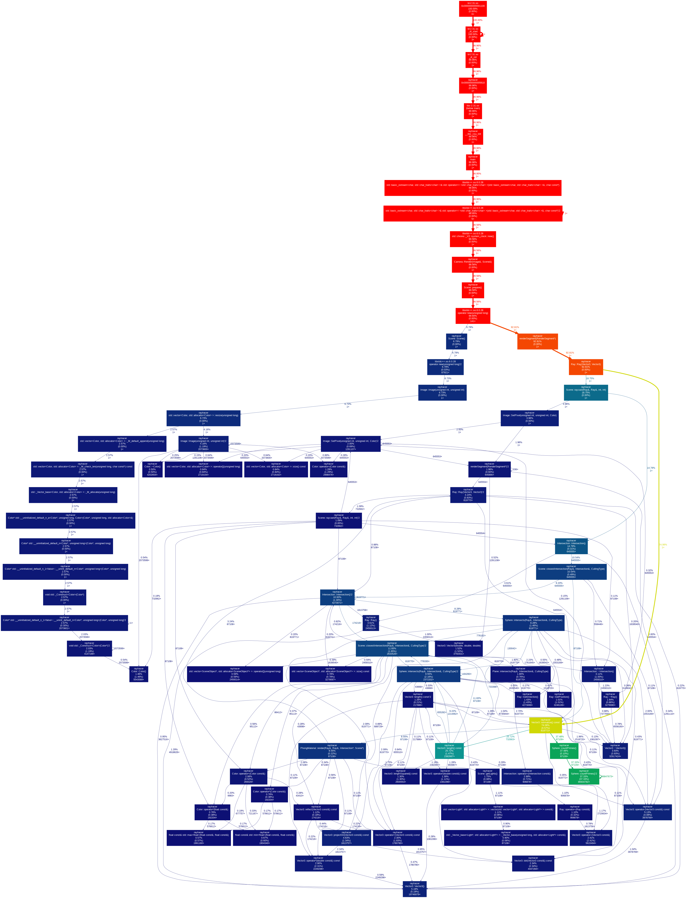

# Optimisation

Vous avez probablement remarqué au cours du développement de votre raytracer que le temps d'exécution augmente très rapidement - en particulier lorsque nous ajoutons plusieurs réflexions de lumière, et encore plus lorsque le nombre d'objets dans la scène augmente.

Comme pour de nombreuses applications, il arrive un moment où nous devons optimiser notre application, car elle fonctionne trop lentement !

Cependant :

> The real problem is that programmers have spent far too much time worrying about efficiency in the wrong places and at the wrong times; premature optimization is the root of all evil (or at least most of it) in programming
>
> _Le vrai problème est que les programmeurs ont passé beaucoup trop de temps à se préoccuper de l'efficacité au mauvais endroit et au mauvais moment ; l'optimisation prématurée est la racine de tous les maux (ou du moins de la plupart d'entre eux) en programmation_
>
> _Donald Knuth, "The Art of Computer Programming"_

Mais lorsque le temps d'exécution devient insupportable, nous pouvons être amenés à faire quelque chose !

## Étape 1 : Mesurer

Tout d'abord, vous devez **mesurer** la fonction ou l'élément qui souffre de lenteur. Cette mesure doit être **précise** et **répétable**. Trop souvent, nous avons l'impression que notre application est lente, mais nous avons besoin de preuves concrètes !

### Temps

La manière la plus simple et la plus facile de mesurer vos performances est de mesurer le temps nécessaire à l'exécution d'une section de notre code.

En C++, nous pouvons utiliser la bibliothèque `chrono` :

```c++
#include <chrono>

int main() {
    ...

    // Measure the start time
    auto begin = std::chrono::high_resolution_clock::now();
    
    camera.Render(image, scene, 2);

    // Measure the end time
    auto end = std::chrono::high_resolution_clock::now();

    // Calculate the delta
    auto elapsed = std::chrono::duration_cast<std::chrono::nanoseconds>(end - begin);

    // Show the delta
    std::printf("Time measured: %.3f seconds.\n", elapsed.count() * 1e-9);
}
```


La mesure du temps n'est pas toujours un moyen fiable d'évaluer notre code, car elle peut dépendre d'un certain nombre de tâches parallèles exécutées sur le même PC au même moment !

Si le temps est votre seul indicateur, l'idéal serait de collecter un certain nombre d'échantillons et de baser notre analyse sur le temps d'exécution moyen, afin d'atténuer tout pic imprévu dans le temps d'exécution.


Trouver le scénario exact (ensemble de paramètres, données d'entrée...) à l'origine des problèmes peut s'avérer délicat :

* Pour un serveur, vous pouvez avoir besoin d'analyser les journaux d'exécution pour voir quelles requêtes prennent le plus de temps. Idéalement, vous devriez pouvoir dupliquer ces requêtes avec les mêmes données afin de pouvoir mesurer les performances.
* Pour notre traceur de rayons, vous devrez peut-être utiliser différentes configurations de scènes, différentes images, différentes résolutions, différentes configurations de shaders (etc.) afin de déterminer le scénario qui provoque un pic dans le temps d'exécution.

Une fois identifié, corrigez votre scénario d'optimisation. Les mesures n'ont pas de sens si les données d'entrée changent constamment, et nous ne pourrons valider que nous avons réellement amélioré les performances sur le jeu de données original !

### Profilers

Il existe un certain nombre de profileurs disponibles sur le marché qui sont capables d'analyser la pile d'appels, l'utilisation de la mémoire, etc. de notre application.

L'un de ces outils est [valgrind](https://valgrind.org/docs/manual/index.html), et plus particulièrement [callgrind](https://valgrind.org/docs/manual/cl-manual.html), qui permet d'analyser la pile d'appels de notre application. Cela nous aidera à déterminer le temps que nous passons dans chaque fonction de notre application.

Pour installer ValGrind dans une distribution Linux (ou un conteneur docker) :

```bash
apt update
apt install valgrind python3 python3-pip graphviz
pip install gprof2dot
```

Nous pouvons alors exécuter notre application en invoquant d'abord ce profileur :

```bash
valgrind --tool=callgrind ./raytracer 
```

Cela créera un fichier `callgrind.out.*` au même endroit, qui peut être converti en une forme visuelle :

```bash
gprof2dot -f callgrind ./callgrind.out.41919 | dot -Tpng -o profiler.png
```

L'image `profiler.png` produite sera similaire à :



Il est clair que notre fonction `renderSegment` est responsable d'un grand pourcentage de notre temps d'exécution !

## Étape 2 : Analyse

Continuez à affiner vos mesures afin d'isoler le principal responsable des mauvaises performances. Il se peut que vous deviez **percer** des sous-sections de votre code pour les isoler, puis percer davantage jusqu'à ce que vous ne puissiez plus subdiviser le temps d'exécution.

Vous devrez alors déterminer **pourquoi** cette section de votre code s'exécute si lentement. Il peut y avoir plusieurs raisons :

* Le code présente une **complexité algorithmique** élevée.
* La quantité de mémoire utilisée est trop importante, ce qui entraîne un **thrashing** ou une **pagination de la mémoire**. Si vous ne savez pas de quoi il s'agit, essayez de le savoir !
* Il y a tout simplement trop de données à traiter en même temps. Peut-être devriez-vous les diviser en morceaux ?
* Un vieux code inefficace ?
* ...

## Étape 3 : Répondre

Il est temps de répondre au problème identifié. Bien entendu, votre réponse peut dépendre de la nature du problème :

* Code inefficace : refonte, utilisation plus efficace de la mémoire, moins d'allocations de mémoire ou de _garbage-collect_, mise en cache, ...
* Complexité informatique : remplacer les structures de données utilisées par des structures plus efficaces. Utiliser de meilleurs algorithmes de recherche ou des techniques pour réduire l'espace de recherche, ...
* Trop de données : seulement si vous êtes certain que votre code est déjà aussi efficace qu'il peut l'être, vous pouvez envisager de l'exécuter sur plusieurs cœurs.


De nos jours, nous avons tendance à être un peu paresseux, et au lieu d'analyser notre code pour trouver des améliorations potentielles, nous passons directement au traitement multicœur.

Vous verrez dans ce cours que même 14 cœurs parallèles ne peuvent pas réaliser la même optimisation qu'une bonne structure de données !


## Step 4 : Test

Une fois votre optimisation mise en œuvre, vous devez **tester votre code**!

**9 fois sur 10, une optimisation casse le code existant !**

Comme pour tous les tests :

* Assurez-vous que les cas habituels sont couverts
* Assurez-vous que les cas limites sont également couverts
* Effectuez des tests unitaires et des tests end-to-end !

## Étape 5 : Mesurer et répéter

Vous avez maintenant implémenté une optimisation, testé que l'optimisation ne casse rien.

Maintenant, avons-nous réellement amélioré les performances ?

Recommencez vos mesures sur le même ensemble de données, et comparez !
