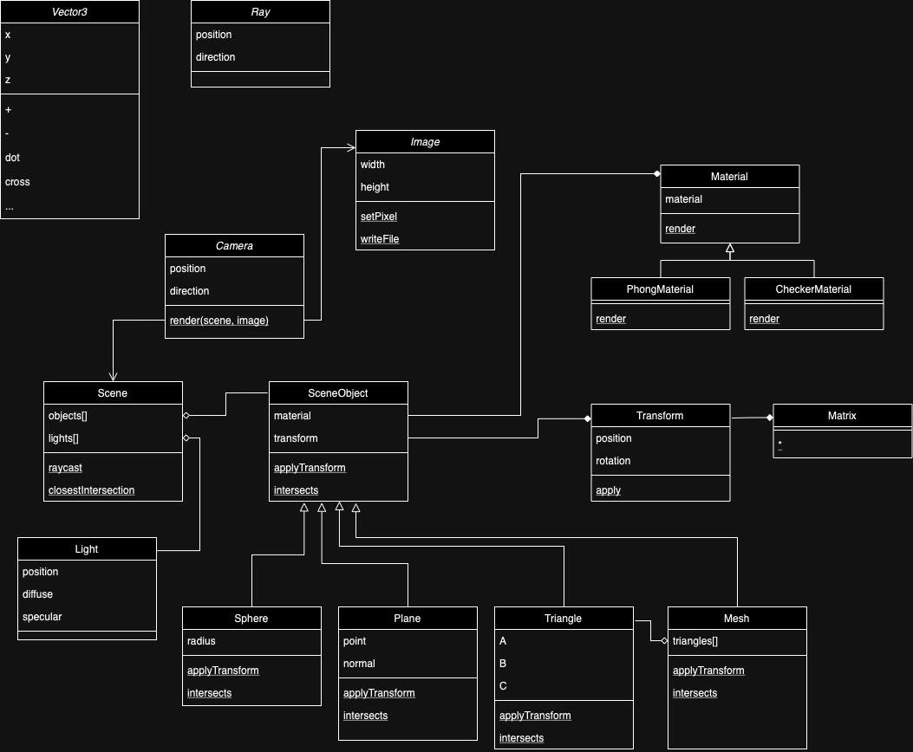

# Stratégie de conception

Lors de la conception du raytracer, je souhaitais disposer d'un paradigme propre et extensible me permettant d'explorer, d'étendre et de maintenir ma base de code.

Le langage de programmation cible est le C++, qui prend en charge la conception orientée objet. 

J'ai donc choisi de modéliser les **entités** que j'ai identifiées. Comment identifier une entité ? En général, je me demande si elle a un nom. Représente-t-elle une chose (physique ou abstraite) ? En général, si je réponds par l'affirmative, il s'agit d'une entité !

Je commence ensuite à déterminer comment chaque entité peut interagir avec les autres.


## Entities

I first tried to identify a base set of entities representing the ray-tracing domain.

Initially, I identified the following entities :

- Image
- Ray

I'm building a raytracer that renders an image after all... simple logic dictates that I would identify these two to start!

But what does a ray consist of ? A position (as a three dimensional vector) and a direction (also as a vector). What does an image consist of ? An arry of pixels (each one having a color). We therefore can add two more entities to our list:

- Vector
- Color

I know that my raytracer is going to render a virtual world (synonyms: *environment*, or *scene*). This scene contains may *objects*.

- Scene
- Object

Having done a bit or reading about ray-tracers, I realise that there is interaction with *lights* in the virtual world, which interacts with the surface of an object. I'm not really sure how this interaction is represented yet, so I'll call it *surface*:

- Light
- Surface

The light hits or *intersects* an object, and we want to calculate the interaction between the light at that intersection point.

- Intersection

I'm starting to get a good idea of the starting set of entities of my app.


## Composition

Maintenant que j'ai un ensemble d'entités, je peux commencer à décider comment mes entités peuvent interagir. Tout d'abord, je passe en revue ma liste et je vois quelle entité en contient une autre :

- Une **scène** contient de nombreux **objets**
- Une **scène** contient plusieurs **lumières**
- Une **image** contient de nombreux pixels, ou **couleurs**.
- Un rayon est composé d'une normale (**vecteur**) et d'une position (**vecteur**)
- ...

Chaque fois qu'il y a composition, cela signifie que je créerais une *variable* membre pour l'entité composée à l'intérieur de l'entité compositrice.

Dans la conception moderne des logiciels, nous avons généralement tendance à privilégier la **composition** par rapport à toutes les autres conceptions. Le principal avantage est que **la somme des composants produit le comportement unique de l'entit**é.

Cela signifie que nous pouvons simplement changer le comportement d'une entité dans son ensemble en modifiant simplement l'un de ses composants, sans toucher à quoi que ce soit d'autre.

Cela a conduit à un **modèle de conception** populaire appelé **Entity-Component** ([référence](https://en.wikipedia.org/wiki/Entity_component_system)), où l'entité contient une liste de composants, chacun responsable d'un aspect particulier (comportement, propriété, ...) de cette entité.

Prenons l'exemple de notre scène. Il s'agit d'une entité dont l'apparence changera en fonction du type d'objet que nous ajouterons à sa liste d'objets. Une métaphore parfaite pour la conception entité-composant.

L'un des principaux avantages de la composition est que chaque membre de l'équipe peut travailler sur un composant sans se marcher sur les pieds !

Dans l'industrie, le modèle de conception entité-composant est très populaire. Jetez un coup d'œil au [moteur de jeu Unity3D](https://unity.com). Le moteur structure ses jeux en utilisant exactement ce modèle de conception. Chaque objet de la scène n'est que le résultat unique de la combinaison spécifique des composants ajoutés à l'objet.


## Héritage

Notre scène contiendra une variété de types d'objets, certains partageant les mêmes types d'informations, d'autres ayant des types de données très différents.  

Quels types d'entités notre scène peut-elle contenir ?

- Sphères
- Les plans
- Triangles
- Maillages de triangles (Mesh)
- ...

Mais l'un des objectifs est de pouvoir stocker une liste unique d'objets contenant un mélange des entités ci-dessus (plutôt qu'une liste individuelle pour chaque type d'entité).

Pour ce faire, nous pouvons utiliser l'**héritage*, qui consiste à extraire toutes les propriétés communes de la liste d'entités pour créer une version plus *générique* qui deviendra la *superclasse* de nos entités.

Dans notre exemple, nous définissons une entité parentale abstraite appelée **SceneObject**, et les autres entités de la scène (Sphere, Plane, Triangle, Mesh) *dérivent* (ou sont des descendants) de cette entité parentale.

Quelles sont les propriétés de ce parent, qui sont partagées par toutes les entités, quel que soit leur type ?

- une position
- un nom ou une ID

Ces objets **héritent** des propriétés et des méthodes de leur ancêtre, d'où le nom d'« héritage ».  

Dans les langages orientés objet, l'un des principaux avantages de l'héritage est que je peux stocker des listes définies à l'aide du type de la superclasse, mais stocker tous les types de la sous-classe dans cette liste. Par exemple, en C# :


```C#
public class SceneObject {
    public Vector3 position;
}

public class Sphere : SceneObject {

}

public class Plane : SceneObject {

}

public class Scene {
    public List<SceneObject> objects = new List<SceneObject>();
}

...
Scene scene = new Scene();
scene.objects.Add(new Sphere());
scene.objects.Add(new Plane());
```

Comme vous pouvez le voir dans l'exemple ci-dessus
- La sphère et le plan vont *hériter* de la variable membre *position* de la superclasse Il n'est pas nécessaire de la redéclarer
- nous pouvons ajouter différents types d'objets à la même liste, car la liste est définie pour contenir des instances du type de la super-classe


## Polymorphisme

Si nous disons que notre scène contient un ensemble d'objets, nous pourrions vouloir un moyen d'itérer génériquement sur chaque objet de la scène et de le rendre :

```c++
foreach(Object obj in scene.objects) {
    obj.render()
}
```

Ou, plus précisément dans le cas de notre raytracer, itérer sur chaque objet de la scène pour voir si le rayon courant le croise :

```c++
Ray ray = ...
foreach(Object obj in scene.objects) {
    if (ray intersects obj) {
        // determine color at intersection point
    }
}
```

Chaque type d'objet a une formule différente pour calculer l'intersection avec un rayon. Où pourrions-nous implémenter cette formule ?

Nous pourrions implémenter une fonction `intersects` sur l'entité rayon, où nous passons la super-classe `SceneObject` (qui peut être une sphère, un plan, etc.) :

```c#
public class Ray {

    bool intersects(SceneObject obj) {


    }
}
```

... mais comme la formule est différente pour chaque forme, nous devrions écrire un code compliqué tel que :


```c#
public class Ray {

    bool intersects(SceneObject obj) {
        if (obj instanceOf Sphere) {

        }
        else if (obj instanceOf Plane) {

        }
        else if (...) {
            ...
        }

    }
}
```

Ce code est non seulement difficile à maintenir, mais à chaque fois que j'ajoute une nouvelle forme à mon raytracer, je dois mettre à jour la classe `Ray`. Ce n'est pas très pratique ! Lorsque vous vous retrouvez à écrire des déclarations `if` sans fin, il est peut-être temps de repenser votre conception. 



Lors de la conception et de l'implémentation, gardez toujours à l'esprit la notion de **séparation des préoccupations**. Un module (une classe, une fonction, ...) ne doit être responsable que d'une seule chose. Dès que vous commencez à mélanger des sujets/thèmes/systèmes, il est temps de remodeler et de refactoriser votre code.




Inversons le problème pour une meilleure conception, en tirant parti de la propriété de **polymorphisme** de la conception orientée objet. En d'autres termes, chaque descendant d'une super-classe peut **override** une méthode pour fournir sa propre implémentation ! C'est pratique, puisque chacune de nos formes peut décider exactement comment calculer une intersection avec un rayon. 

Cela permet d'obtenir un code plus clair, en **encapsulant** le comportement dans l'entité elle-même.


```c#
public class SceneObject {
    public bool intersects(Ray r) {
        return false;
    }
}

public class Sphere : SceneObject {
    public override bool intersects(Ray r) {
        // unique logic for calculating an intersection between a ray and a sphere
    }
}

public class Plane : SceneObject {
    public override intersects(Ray r) {
        // unique logic for calculating an intersection between a ray and a plane
    }
}
```

Notez que la signature de la fonction `intersects` est identique pour toutes les formes, mais que le comportement change pour chaque cas spécifique. Si je veux ajouter une nouvelle forme, je dois simplement surcharger la fonction `intersects` pour ma forme, sans modifier `Ray` ou toute autre entité.

Mon algorithme de calcul des intersections de la scène devient beaucoup plus simple et n'a pas besoin d'être modifié même si nous ajoutons de nouveaux types de formes :

```c#
Ray ray = ...
foreach(SceneObject obj in scene.objects) {
    if (obj.intersects(ray)) {
        // determine color at intersection point
    }
}
```

## Interfaces

En effet, nous avons créé une *interface* que tous les objets de la scène doivent satisfaire pour être compris par notre scène. 

Qu'est-ce qu'une interface ? 

Une interface est une abstraction du comportement souhaité, de sorte que les détails de l'implémentation sont cachés à l'appelant. C'est un moyen de standardiser le mécanisme d'interaction entre deux systèmes, dont l'implémentation peut varier, ce qui apporte flexibilité et facilité de maintenance.

Voici quelques exemples d'interfaces :

- **Systèmes d'exploitation**: les systèmes d'exploitation fournissent une couche d'abstraction entre le matériel et les applications qui tournent dessus. Ainsi, les applications n'ont pas besoin de connaître les détails précis de l'implémentation du matériel de niveau inférieur. Par exemple, un système d'exploitation spécifiera une interface `write(data)` qui écrit des données sur un disque. Un pilote de périphérique implémente cette fonction d'une manière spécifique pour le matériel cible (disque magnétique ou SSD). Les applications utilisateur qui s'exécutent sur le système d'exploitation n'ont besoin que de connaître la fonction `write`, sans avoir besoin de savoir comment elle est implémentée. 
- **API**: Les API, ou **interfaces de programmation d'applications**, c'est exactement cela ! Lorsque nous appelons une API sur le web, nous n'avons aucune idée de la manière dont elle est mise en œuvre. Nous pourrions tout à fait modifier l'implémentation d'une API sans qu'aucun client ne s'en aperçoive !

Les interfaces bien connues dans le domaine graphique sont OpenGL et DirectX.

Même si nous n'utilisions pas un paradigme orienté objet, la notion d'interface est très utile. Si nous devions utiliser une approche plus *fonctionnelle*, nous pourrions également envelopper une implémentation spécifique dans des fonctions qui partagent la même signature. En fin de compte, le résultat polymorphe est le même : nous pouvons obtenir un comportement hétérogène en fournissant différentes implémentations à la même signature de fonction.


## Raffinement itératif

Au fur et à mesure que nous poursuivons l'implémentation de notre raytracer, certains détails se révèlent (comme de nouvelles entités, ou la fusion de certaines entités). Typiquement, cela nécessite un peu de refactoring afin d'affiner la conception. Voici quelques exemples :

- `Material` au lieu de `Surface` : j'ai réalisé que j'avais différents types de stratégies de rendu (`Phong`, `Checkerboard`) qui prenaient toujours les mêmes paramètres (point d'intersection, normale, etc.) pour calculer la couleur d'un pixel à un point d'intersection. J'ai harmonisé cela dans une superclasse appelée `Material`, avec une spécialisation pour chaque type de surface dans mon raytracer

- `Transform` au lieu d'une position : j'ai réalisé que les objets peuvent avoir une position et une rotation. Au lieu de spécifier une position directement comme variable de mes SceneObjects, je préfère créer une sous-composition appelée Transform. Cela me permet d'utiliser une méthode plus optimale pour déplacer les objets dans ma scène en appliquant quelques multiplications de matrices.

Il est important de noter que dans les premières itérations de mon développement, je n'ai pas pris en compte ces entités, ni même anticipé leur existence ! Nous devons être suffisamment flexibles pour adapter et affiner notre conception au fur et à mesure que nous découvrons de nouveaux éléments !


## UML

Le diagramme [UML](https://en.wikipedia.org/wiki/Unified_Modeling_Language) final (partiel) de notre raytracer est le suivant : 



Notez l'utilisation de symboles différents pour les types d'interactions entre entités : 

- composition : un losange
- flèche triangulaire : héritage
- flèche simple : appel de méthode


