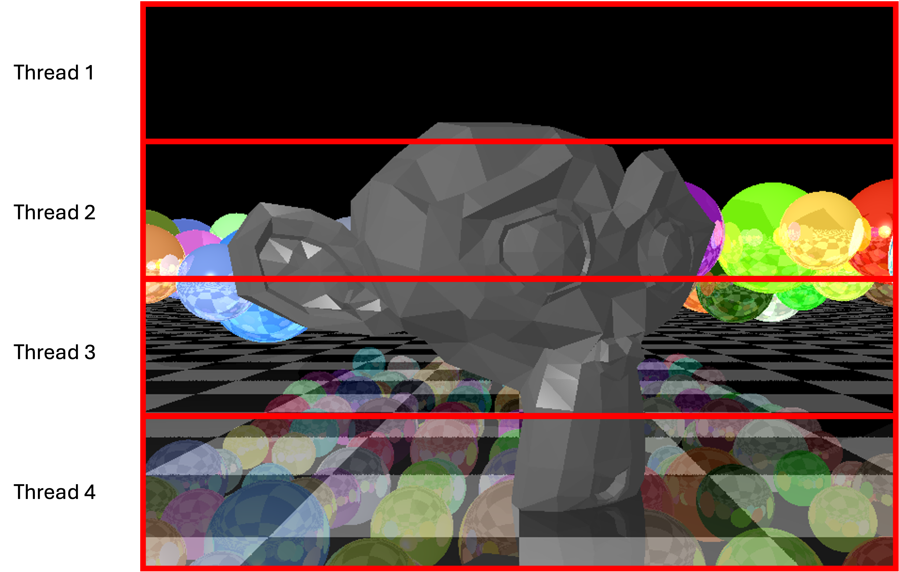

# Le multithreading de base

De nos jours, un moyen courant d'optimiser les performances consiste à tirer parti des processeurs multicœurs et à exécuter le code en parallèle.

Lors de l'exécution de threads concurrents, certaines contraintes importantes doivent être respectées afin de garantir la sécurité des données.

Par exemple, si les deux threads essaient d'accéder à un bloc de mémoire en même temps (l'un écrit pendant que l'autre lit), il est très probable que le thread qui lit lise des données incohérentes.

Dans ce cas, nous devons *verrouiller* certaines parties de notre mémoire vive, ou même *les sections critiques de notre code*, afin d'empêcher l'accès simultané là où cela peut être dangereux. Les mécanismes de verrouillage tels que les *mutex* et les *semaphores* peuvent être utilisés pour contrôler l'accès à la mémoire partagée ([lecture complémentaire](https://www.geeksforgeeks.org/mutex-vs-semaphore/)).


## Raytracer et threading

Notre raytracer est un problème qui se prête bien au multithreading, pour une raison spécifique : chaque pixel est entièrement indépendant et peut être calculé sans rien savoir des pixels qui l'entourent. 

Cette indépendance se prête bien au multithreading puisqu'il n'y a pas de problème de concurrence - nous pouvons simplement laisser chaque thread calculer ses propres pixels sans avoir besoin de partager des ressources ou de la mémoire avec d'autres threads. 

Comment faire ? Eh bien, nous pouvons simplement diviser notre image en sections, et déléguer chaque section à un thread différent : 



Chaque fil rend sa propre image, et une fois que tous les fils sont terminés, il suffit d'assembler les sections pour obtenir la section finale.

## Le multithreading et le C++

Pour utiliser le threading dans notre projet C++, nous devons d'abord dire à notre compilateur de l'inclure. Si vous utilisez CMake, nous pouvons ajouter ce qui suit à la racine `CMakeLists.txt`


```cmake
set(THREADS_PREFER_PTHREAD_FLAG ON)
find_package(Threads REQUIRED)

...

target_link_libraries(raytracer 
                      PRIVATE Threads::Threads
                      ...
```

Dans notre code, nous pouvons alors obtenir le nombre de cœurs de la machine et créer autant de threads que nous le souhaitons :

```c++
#include <thread>

void renderSegment(Segment * seg) {
    // seg is a class/struct containing parameters about the segment 
    // to render, such as the height, width, etc
}

void main() {
    // Get the number of threads
    unsigned int nthreads = std::thread::hardware_concurrency();

    std::vector<std::thread> threads;

    // Divide the image up into `nthreads`segments

    // Create a new thread for each segment by calling the function to be executed 
    // by the thread, and passing some parameters
    for (int i = 0; i < nthreads; ++i) {
       Segment *seg = new Segment();
       seg->... =

       threads.push_back(std::thread(renderSegment, seg));
    }

    // We will immediately end up here
    // ... wait until all the threads are done before continuing

    for (auto& thread : threads)
    { 
        thread.join(); 
    }

    // Construct the final image

}

```